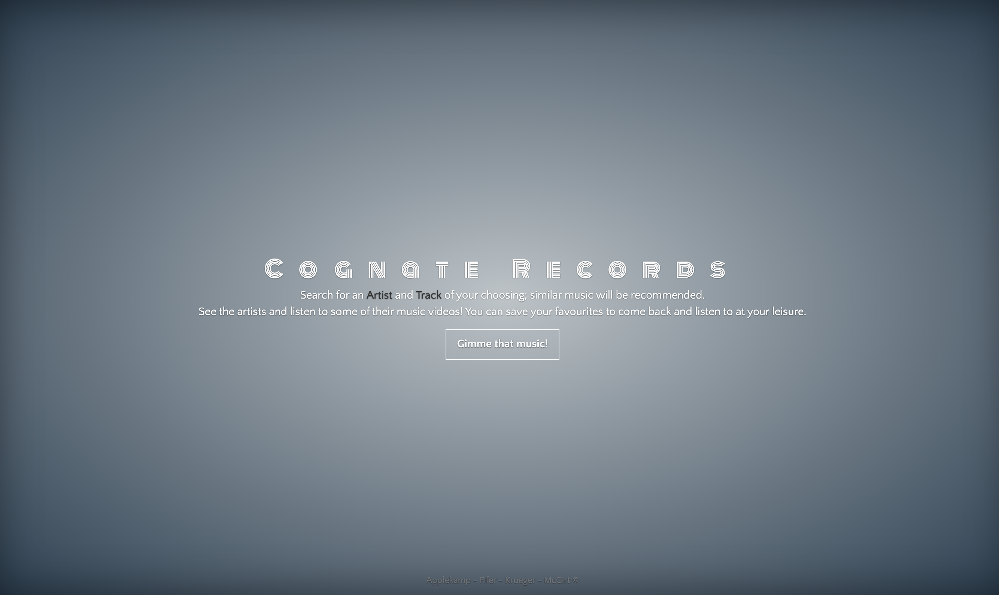

# Cognate Records

This is an app that utilises:
* Javascript
* HTML
* CSS
* AJAX
* Bands in Town API
* Last.fm API

---

## [Link to Github Pages](https://seyleigh.github.io/Project1group4/)

---

This was our first project in the Bootcamp. Users can search for their favourite artists and similar artists will show up using an ajax call. Clicking on one of the similar artists will open youtube and that artists music videos. Alternatively if you go to tracks - you can search for an artist and album and it will show similar tracks based on your search parameters using last.fm api.

---

